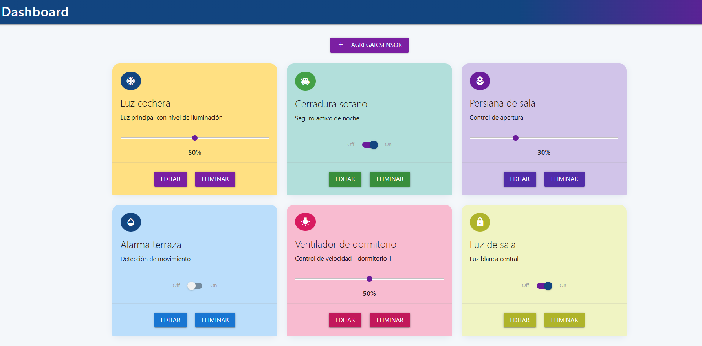

<a >
    
</a>

Web App - TF
=======================




Esta sección es una guía con los pasos escenciales para que puedas poner en marcha la aplicación.

- Para ejecutar la aplicación tenes que correr el comando `docker-compose up` desde la raíz del proyecto

- Para acceder al cliente web ingresa a a la URL [http://localhost:8000/](http://localhost:8000/) y para acceder al admin de la DB accedé a [localhost:8001/](http://localhost:8001/). 


## Detalles principales 🔍

En esta sección vas a encontrar las características más relevantes del proyecto.

<details><summary><b>Mira los detalles más importantes de la aplicación</b></summary><br>
<br>

### Arquitectura de la aplicación

### El cliente web

El cliente web es una Single Page Application que se comunica con el servicio en NodeJS mediante JSON a través de requests HTTP. Puede consultar el estado de dispositivos en la base de datos (por medio del servicio en NodeJS) y también cambiar el estado de los mismos. Los estilos del código están basados en **Material Design**.

### El servicio web

El servicio en **NodeJS** posee distintos endpoints para comunicarse con el cliente web mediante requests HTTP enviando **JSON** en cada transacción. Procesando estos requests es capaz de comunicarse con la base de datos para consultar y controlar el estado de los dispositivos, y devolverle una respuesta al cliente web también en formato JSON. Así mismo el servicio es capaz de servir el código del cliente web.

### La base de datos

La base de datos se comunica con el servicio de NodeJS y permite almacenar el estado de los dispositivos en la tabla **Devices**. Ejecuta un motor **MySQL versión 5.7** y permite que la comunicación con sus clientes pueda realizarse usando usuario y contraseña en texto plano. En versiones posteriores es necesario brindar claves de acceso, por este motivo la versión 5.7 es bastante utilizada para fases de desarrollo.

### El administrador de la DB

Para esta aplicación se usa **PHPMyAdmin**, que es un administrador de base de datos web muy utilizado y que podés utilizar en caso que quieras realizar operaciones con la base, como crear tablas, modificar columnas, hacer consultas y otras cosas más.

### El compilador de TypeScript

**TypeScript** es un lenguaje de programación libre y de código abierto desarrollado y mantenido por Microsoft. Es un superconjunto de JavaScript, que esencialmente añade tipos estáticos y objetos basados en clases. Para esta aplicación se usa un compilador de TypeScript basado en una imagen de [Harmish](https://hub.docker.com/r/harmish) en Dockerhub, y está configurado para monitorear en tiempo real los cambios que se realizan sobre el directorio **src/frontend/ts** y automáticamente generar código compilado a JavaScript en el directorio  **src/frontend/js**. Los mensajes del compilador aparecen automáticamente en la terminal al ejecutar el comando **docker-compose up**.

### Ejecución de servicios

Los servicios de la aplicación se ejecutan sobre **contenedores de Docker**, así se pueden desplegar de igual manera en diferentes plataformas. Los detalles sobre cómo funcionan los servicios los podés ver directamente en el archivo **docker-compose.yml**.

### Organización del proyecto

En la siguiente ilustración podés ver cómo está organizado el proyecto para que tengas en claro qué cosas hay en cada lugar.

```sh
├── db                          # directorio de la DB
│   ├── data                    # estructura y datos de la DB
│   └── dumps                   # directorio de estructuras de la DB
│       └── smart_home.sql      # estructura con la base de datos "smart_home"
└── src                         # directorio codigo fuente
│   ├── backend                 # directorio para el backend de la aplicacion
│   │   ├── index.js            # codigo principal del backend
│   │   ├── mysql-connector.js  # codigo de conexion a la base de datos
│   │   ├── package.json        # configuracion de proyecto NodeJS
│   │   └── package-lock.json   # configuracion de proyecto NodeJS
│   └── frontend                # directorio para el frontend de la aplicacion
│       ├── js                  # codigo javascript que se compila automáticamente
│       ├── static              # donde alojan archivos de estilos, imagenes, fuentes, etc.
│       ├── ts                  # donde se encuentra el codigo TypeScript a desarrollar
│       └── index.html          # archivo principal del cliente HTML
├── docker-compose.yml          # archivo donde se aloja la configuracion completa
├── README.md                   # este archivo
├── CHANGELOG.md                # archivo para guardar los cambios del proyecto
├── LICENSE.md                  # licencia del proyecto
```


</details>

## Detalles de implementación 💻

En esta sección podés ver los detalles específicos de funcionamiento del código y que son los siguientes.

<details><summary><b>Mira los detalles de implementación</b></summary><br>

### Agregar un dispositivo

- Hacer click sobre el boton "Agregar Sensor" y se abrirá un formulario
- Ingresar los siguiente datos:
    - Nombre del sensor
    - Descripción
    - Tipo de control (Switch o Slider bar)
    - Nombre del icono
    - Valor inicial (decimal de 0 a 1)
- Al completar el formulario dar clik sobre el boton "Crear sennsor"


### Frontend

El poryecto fue desarrollado utilizando tecnologias como TypScript, HTML y Materialize, organizando las funciones principales en módulos separados para mantener el codigo ordenado. A continuacion se detalla la estrucutra del proyecto y las princiaples funciones e interacciones del usuario.

- Para la gestión de tarjetas (card), se utilizan archivos como cardDB.ts, cardAdd.ts, cardEdit.ts, cardEditSendDB.ts y cardDelete.ts, que permiten crear, editar, eliminar y almacenar tarjetas de manera eficiente. La navegación entre tarjetas se realiza a través de un slider implementado en cardSlider.ts, lo que facilita una experiencia visual dinámica. Además, el archivo device.ts se encarga de manejar aspectos específicos del entorno o dispositivo donde se ejecuta la aplicación
- Las principales interacciones de usuario incluyen la posibilidad de agregar nuevas tarjetas mediante formularios, editar tarjetas existentes con validaciones y confirmaciones, eliminar tarjetas con mensajes de advertencia y navegar entre ellas de forma intuitiva. Se priorizó la modularidad del código, la persistencia local de los datos y la retroalimentación inmediata al usuario para asegurar una experiencia fluida y confiable.

    A continuación, se destacan las principales interacciones de usuario implementadas:

    - Agregar una nueva tarjeta mediante un formulario con validación de datos.
    - Editar tarjetas existentes, mostrando los datos actuales y permitiendo su modificación.
    - Eliminar tarjetas seleccionadas, con confirmación previa para evitar borrados accidentales.
    - Navegar entre tarjetas de forma visual e intuitiva utilizando un slider.
    - Recibir mensajes de error o confirmación según las acciones realizadas.

### Backend

El backend, desarrollado en Node.js con JavaScript, utiliza Express para gestionar las rutas HTTP y MySQL para la persistencia de datos. El archivo index.js actúa como servidor, recibiendo solicitudes del frontend y respondiendo con la información solicitada. La conexión a la base de datos MySQL se realiza a través de mysql-connector.js, permitiendo ejecutar consultas SQL para gestionar los datos de las tarjetas.

La estructura de la base de datos está definida en smart_home.sql, asegurando la integridad de los datos. El archivo package.json gestiona las dependencias necesarias, como Express y el conector de MySQL.

El frontend se comunica con el backend mediante solicitudes HTTP, permitiendo operaciones CRUD (crear, leer, actualizar, eliminar) sobre las tarjetas. El backend procesa estas solicitudes, interactúa con la base de datos y responde al cliente web con los resultados.

Entre las responsabilidades más relevantes del backend se encuentran:

- Gestionar la autenticación y el flujo de datos entre el cliente web y la base de datos.
- Ejecutar operaciones CRUD sobre las tarjetas de manera eficiente y segura.
- Mantener la integridad y consistencia de los datos almacenados en MySQL.
- Responder al frontend con información actualizada y mensajes de estado claros.
- Facilitar la escalabilidad y el mantenimiento del sistema gracias a su estructura modular.

<details><summary><b>Endpoints disponibles</b></summary><br>


1) Obtener todos los dispositivos.

```json
{
    "method": "GET",
    "endpoint": "/devices/",
    "request_headers": "application/json",
    "request_body": "",
    "response_code": 200,
    "response_body": [
        {
            "id": 1,
            "name": "Kitchen Light",
            "description": "Luz de la cocina",
            "state": 1,
            "type": 0,
            "value": null,
            "icon": "light_bulb"
        }
    ]
}
``` 

2) Crear un nuevo dispositivo.

```json
{
    "method": "POST",
    "endpoint": "/devices/",
    "request_headers": "application/json",
    "request_body": {
        "name": "Bedroom Light",
        "description": "Luz del dormitorio",
        "tipo": 0,
        "valor": 0,
        "iconMate": "light_bulb"
    },
    "response_code": 201,
    "response_body": {
        "message": "Dispositivo creado exitosamente",
        "id": 3
    }
}
``` 

3) Actualizar un dispositivo existente.

```json
{
    "method": "PUT",
    "endpoint": "/devices/:id",
    "request_headers": "application/json",
    "request_body": {
        "name": "Updated Device Name",
        "valor": 1,
        "description": "Nueva descripción"
    },
    "response_code": 200,
    "response_body": {
        "message": "Dispositivo actualizado"
    }
}
``` 

4) Eliminar un dispositivo.

```json
{
    "method": "DELETE",
    "endpoint": "/devices/:id",
    "request_headers": "application/json",
    "request_body": "",
    "response_code": 200,
    "response_body": {
        "message": "Dispositivo eliminado"
    }
}
``` 

</details>

</details>


## Tecnologías utilizadas 🛠️

En esta sección podés ver las tecnologías más importantes utilizadas.

<details><summary><b>Mira la lista completa de tecnologías</b></summary><br>

* [Docker](https://www.docker.com/) - Ecosistema que permite la ejecución de contenedores de software.
* [Docker Compose](https://docs.docker.com/compose/) - Herramienta que permite administrar múltiples contenedores de Docker.
* [Node JS](https://nodejs.org/es/) - Motor de ejecución de código JavaScript en backend.
* [MySQL](https://www.mysql.com/) - Base de datos para consultar y almacenar datos.
* [PHPMyAdmin](https://www.phpmyadmin.net/) - Administrador web de base de datos.
* [Material Design](https://material.io/design) - Bibliotecas de estilo responsive para aplicaciones web.
* [TypeScript](https://www.typescriptlang.org/) - Superset de JavaScript tipado y con clases.

</details>

