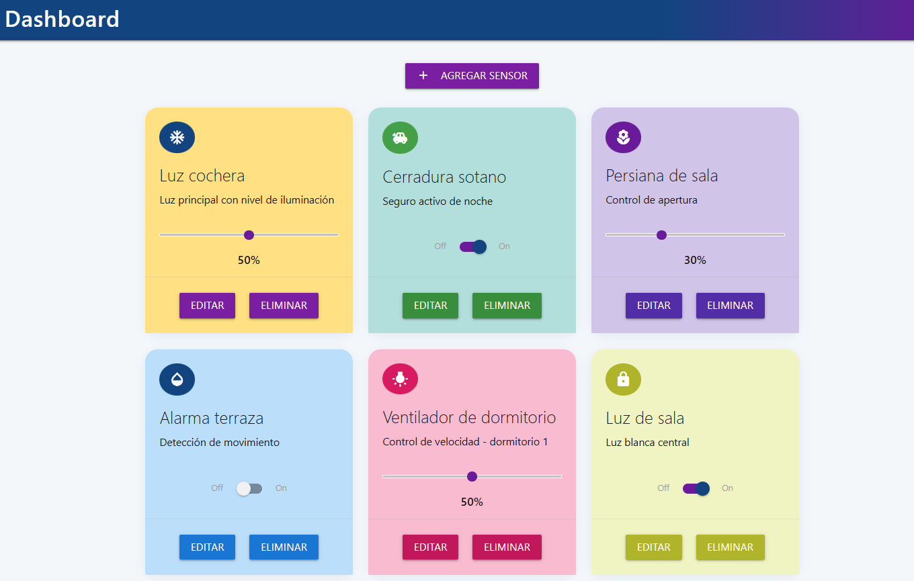

<a >
    
</a>

Web App - TF
=======================




Esta sección es una guía con los pasos escenciales para que puedas poner en marcha la aplicación.

- Para ejecutar la aplicación tenes que correr el comando `docker-compose up` desde la raíz del proyecto

- Para acceder al cliente web ingresa a a la URL [http://localhost:8000/](http://localhost:8000/) y para acceder al admin de la DB accedé a [localhost:8001/](http://localhost:8001/). 


## Detalles principales 🔍

En esta sección vas a encontrar las características más relevantes del proyecto.

<details><summary><b>Mira los detalles más importantes de la aplicación</b></summary><br>
<br>


### Organización del proyecto

En la siguiente ilustración podés ver cómo está organizado el proyecto para que tengas en claro qué cosas hay en cada lugar.

```sh
├── db                          # directorio de la DB
│   ├── data                    # estructura y datos de la DB
│   └── dumps                   # directorio de estructuras de la DB
│       └── smart_home.sql      # estructura con la base de datos "smart_home"
└── src                         # directorio codigo fuente
│   ├── backend                 # directorio para el backend de la aplicacion
│   │   ├── index.js            # codigo principal del backend
│   │   ├── mysql-connector.js  # codigo de conexion a la base de datos
│   │   ├── package.json        # configuracion de proyecto NodeJS
│   │   └── package-lock.json   # configuracion de proyecto NodeJS
│   └── frontend                # directorio para el frontend de la aplicacion
│       ├── js                  # codigo javascript que se compila automáticamente
│       ├── static              # donde alojan archivos de estilos, imagenes, fuentes, etc.
│       ├── ts                  # donde se encuentra el codigo TypeScript a desarrollar
│       └── index.html          # archivo principal del cliente HTML
├── docker-compose.yml          # archivo donde se aloja la configuracion completa
├── README.md                   # este archivo
├── CHANGELOG.md                # archivo para guardar los cambios del proyecto
├── LICENSE.md                  # licencia del proyecto
```


</details>

## Detalles de implementación 💻

El proyecto implementado tiene las siguientes funcionalidades:

**Frontend**
1. Edición de dispositivos existentes: nombre, descripción y tipo.
2. Posibilidad de agregar o quitar dispositivos.
3. Uso de slider bar (rango de 0 a 100%) y switch (0 o 1).

**Backend**
1. Funcionalidad para borrar un dispositivo.
2. Funcionalidad para agregar un dispositivo.
3. Actualizar cualquier dato de cada dispositivo.


<details><summary><b>Mira los detalles de implementación</b></summary><br>

### Agregar un dispositivo

- Hacer click sobre el boton "Agregar Sensor" y se abrirá un formulario
- Ingresar los siguiente datos:
    - Nombre del sensor
    - Descripción
    - Tipo de control (Switch o Slider bar)
    - Nombre del icono
    - Valor inicial (decimal de 0 a 1)
- Al completar el formulario dar clik sobre el boton "Crear sennsor"


### Frontend

El frontend de este proyecto fue desarrollado utilizando TypeScript, HTML y la librería Materialize para el diseño visual. El objetivo principal fue crear un dashboard donde se pueden visualizar y gestionar distintos sensores, mostrando cada uno en una tarjeta (card) para facilitar su comprensión y control. Para mantener el código ordenado y modular, las funciones principales se separaron en diferentes archivos según su responsabilidad.

Para la gestión de tarjetas, se utilizan archivos como cardDB.ts, cardAdd.ts, cardEdit.ts, cardEditSendDB.ts y cardDelete.ts. Estos archivos permiten agregar, editar y eliminar tarjetas de manera eficiente. El archivo cardSlider.ts se encarga de implementar los sliders o switches que aparecen en las tarjetas, facilitando el cambio de estado de los sensores de forma visual y rápida. Además, device.ts maneja aspectos específicos del dispositivo donde se ejecuta la aplicación, adaptando la funcionalidad según sea necesario. En las siguietnes lineas se detalla cada script TypeScript con su respectiva funcioanlidad.

- cardDB.ts: Gestiona obtener informacion de la base de datos y cargar en cada tarjeta.
- cardAdd.ts: Función para agregar nuevas tarjetas, incluyendo la validación de los datos ingresados por el usuario.
- cardEdit.ts: Permite editar tarjetas existentes, se activa con el boton "Editar", mostrando los datos actuales en el formulario de edición.
- cardEditSendDB.ts: Se encarga de enviar los cambios realizados en la edición de una tarjeta a la base de datos local.
- cardDelete.ts: Gestiona la eliminación de tarjetas, a trves del boton "Eliminar", solicitando confirmación antes de borrar.
- cardSlider.ts: Implementa el slider o switch dentro de cada tarjeta, permitiendo cambiar el estado de los sensores de forma visual.
- mian.ts: Organiza todas las funciones independientes.

En cuanto a la interacción del usuario, este puede agregar nuevas tarjetas llenando un formulario, editar las tarjetas existentes (con validaciones para asegurar la integridad de los datos), y eliminar tarjetas, siempre solicitando confirmación para evitar borrados accidentales. La navegación entre las tarjetas se realiza de manera sencilla gracias al slider, y la aplicación muestra mensajes claros para informar sobre el estado de las acciones realizadas. Se priorizó la modularidad del código, la persistencia local de los datos y la retroalimentación inmediata al usuario para asegurar una experiencia fluida y confiable.

Principales interacciones de usuario:

- Agregar una nueva tarjeta llenando un formulario con validación.
- Editar tarjetas ya creadas, mostrando los datos actuales para modificarlos.
- Eliminar tarjetas, siempre pidiendo confirmación antes.
- Navegar entre tarjetas usando un slider visual.
- Recibir mensajes de error o confirmación según lo que se haga.

### Backend

El backend, desarrollado en Node.js con JavaScript, utiliza Express para gestionar las rutas HTTP y MySQL para la persistencia de datos. El archivo index.js actúa como servidor, recibiendo solicitudes del frontend y respondiendo con la información solicitada. La conexión a la base de datos MySQL se realiza a través de mysql-connector.js, permitiendo ejecutar consultas SQL para gestionar los datos de las tarjetas.

La estructura de la base de datos está definida en smart_home.sql, asegurando la integridad de los datos. El archivo package.json gestiona las dependencias necesarias, como Express y el conector de MySQL.

El frontend se comunica con el backend mediante solicitudes HTTP, permitiendo operaciones CRUD (crear, leer, actualizar, eliminar) sobre las tarjetas. El backend procesa estas solicitudes, interactúa con la base de datos y responde al cliente web con los resultados.

Entre las responsabilidades más relevantes del backend se encuentran:

- Gestionar la autenticación y el flujo de datos entre el cliente web y la base de datos.
- Ejecutar operaciones CRUD sobre las tarjetas de manera eficiente y segura.
- Mantener la integridad y consistencia de los datos almacenados en MySQL.
- Responder al frontend con información actualizada y mensajes de estado claros.
- Facilitar la escalabilidad y el mantenimiento del sistema gracias a su estructura modular.

<details><summary><b>Endpoints disponibles</b></summary><br>


1) Obtener todos los dispositivos.

```json
{
    "method": "GET",
    "endpoint": "/devices/",
    "request_headers": "application/json",
    "request_body": "",
    "response_code": 200,
    "response_body": [
        {
            "id": 1,
            "name": "Luz 2",
            "description": "Luz de la cocina",
            "tipo": 0,
            "valor": null,
            "iconMate": "toys"
        }
    ]
}
``` 

2) Crear un nuevo dispositivo.

```json
{
    "method": "POST",
    "endpoint": "/devices/",
    "request_headers": "application/json",
    "request_body": {
        "name": "Bedroom Light",
        "description": "Luz del dormitorio",
        "tipo": 0,
        "valor": 0,
        "iconMate": "light_bulb"
    },
    "response_code": 201,
    "response_body": {
        "message": "Dispositivo creado exitosamente",
        "id": 3
    }
}
``` 

3) Actualizar un dispositivo existente.

```json
{
    "method": "PUT",
    "endpoint": "/devices/:id",
    "request_headers": "application/json",
    "request_body": {
        "name": "Updated Device Name",
        "valor": 1,
        "description": "Nueva descripción"
    },
    "response_code": 200,
    "response_body": {
        "message": "Dispositivo actualizado"
    }
}
``` 

4) Eliminar un dispositivo.

```json
{
    "method": "DELETE",
    "endpoint": "/devices/:id",
    "request_headers": "application/json",
    "request_body": "",
    "response_code": 200,
    "response_body": {
        "message": "Dispositivo eliminado"
    }
}
``` 

</details>

</details>


## Tecnologías utilizadas 🛠️

En esta sección podés ver las tecnologías más importantes utilizadas.

<details><summary><b>Mira la lista completa de tecnologías</b></summary><br>

* [Docker](https://www.docker.com/) - Ecosistema que permite la ejecución de contenedores de software.
* [Docker Compose](https://docs.docker.com/compose/) - Herramienta que permite administrar múltiples contenedores de Docker.
* [Node JS](https://nodejs.org/es/) - Motor de ejecución de código JavaScript en backend.
* [MySQL](https://www.mysql.com/) - Base de datos para consultar y almacenar datos.
* [PHPMyAdmin](https://www.phpmyadmin.net/) - Administrador web de base de datos.
* [Material Design](https://material.io/design) - Bibliotecas de estilo responsive para aplicaciones web.
* [TypeScript](https://www.typescriptlang.org/) - Superset de JavaScript tipado y con clases.

</details>

